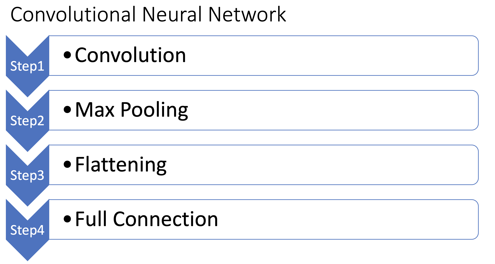
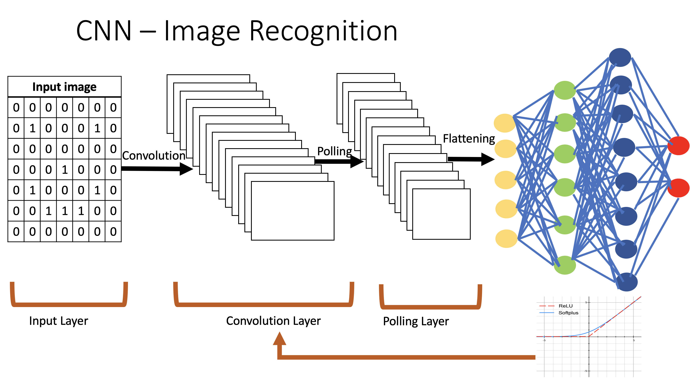

# Deep Learning - CNN Based Image Recognition

Deep Learning CNN model which recognizes images. This projects provides generic framework for building image recognition. The framework als uses image augmentation to achieve better results. This program when run locally will take lots of time. Further image size is intentionally chosen less in favour of fast run. Best results will be achieved when ran on GPU. Further accuracy of 85% on the test data was achieved.

Visual learning is one of the major parts of human learning. Convolutional Neural Network (CNN) has made computer vision and hence computer-based visual learning possible. CNN based computer vision learning has many business use cases:

1. **Facial recognition** - get rid of old style access card entry to the office and may more business use cases.

2. **Self-driving cars** - detect various roads sign and assist self-driving algorithm

3. **Car number plate detection** - paperless parking ticket experience

4. **HR bots taking interviews** - job seekers interview behavior analysis and hence bots recommendations for employee fit for a company

5. **Bank check recognition**

6. **Retail store experience** like Amazon GO

7. etc ..

Check out my GitHub project which provides Keras based CNN model for facial recognition. It's a generic approach for image recognition, where the dataset is decoupled from CNN model. Building such a model consist of the following steps:
Convolution > Pooling > Flattening > Full connection (a neural network)
Image augmentation is used for accuracy of 85%. This is not bad at all!!

The performance can be further improved by running this on GPU and using image_shape of 256 x 3 X 3 and adding more convolution layer

Try it out!!!

# Image Recognition CNN Architecture

CNN network creation is a four step process:

The architecture consist of following steps:

**_Step 1_** - Convolution (with 32 feature detector & rectifier 0 relu. Since images are colored input_shape will be used 3D array of 64x64X3 (smaller format for local machine run (IN GPU - 256x256X3 can be used which will give better results)

**_Step 2_** - Pooling - reducing the size of feature map. Here Max Pooling will be used. To achieve better accuracy - add a second convolution layer

**_Step 3_** - Flattening

**_Step 4_** - Full connection - PASS Step 3 output to ANN

**NOTE:** Image augmentation for better results i.e. flip, invert etc etc images provided, hence helps in creating different observations of the images

The above architecture is show pictorially below:

 How to use CNN Framework? - putting things into prospective

1. Create a director imagedb

2. With in imagedb create two subfolders:

    2.1) training_set
  
    2.2) test_set
  
3. With the training_set and test_set create image classification holder like "Gaurav" etc and put your different images inside it.

